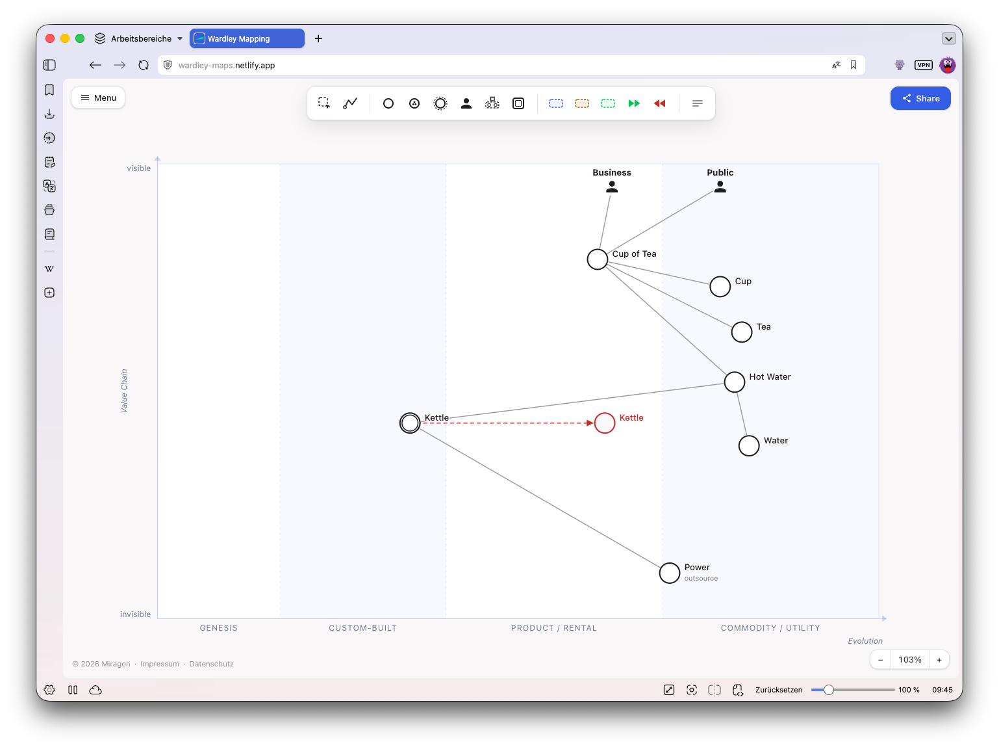

# Event Storming Modeler — Web App

[](https://github.com/Miragon/event-storming-modeler/blob/main/LICENSE)

A browser editor for [Event Storming](https://www.eventstorming.com/) boards: an Excalidraw-style
canvas with URL sharing, drag-and-drop import of `.storm`/`.json`, and PNG/SVG picture export.
The demo app for the `@miragon/event-storming-*` packages.

**[Live demo](https://event-storming-modeler.netlify.app)**



_Screenshot to be regenerated for the Event Storming UI._

## Run locally

From the monorepo root:

```bash
npm install
npm run dev:webapp         # named HTTPS URL via Portless — one-time setup in CONTRIBUTING.md
npm run dev:webapp:plain   # plain Vite, http://localhost:5180
```

## License

MIT
